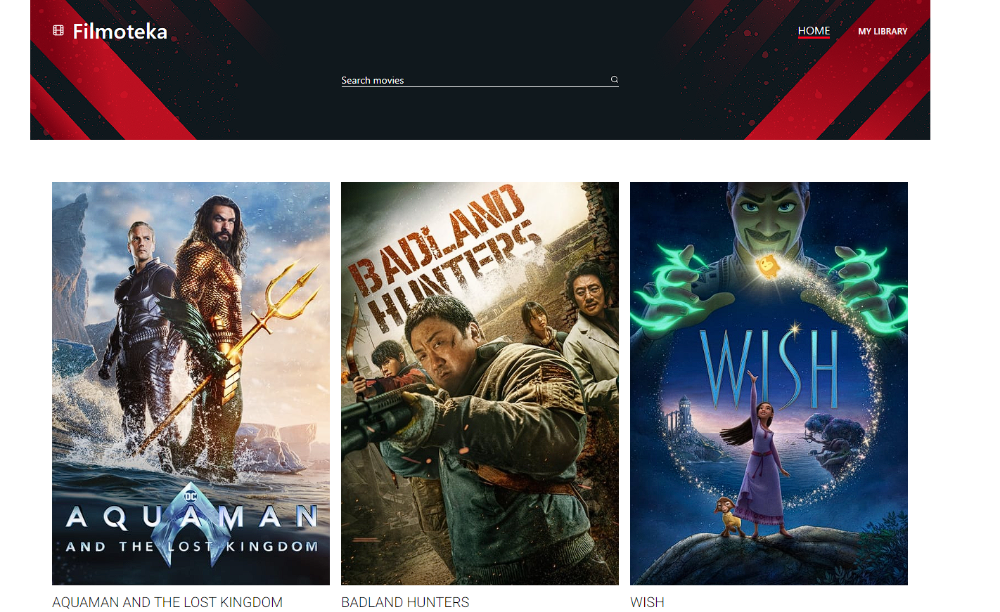
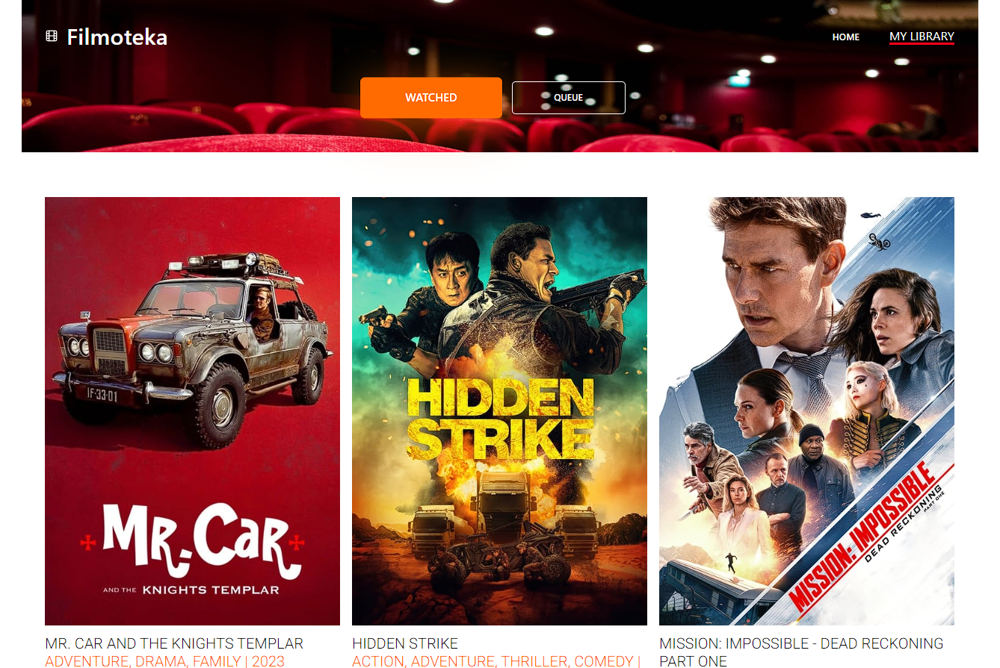
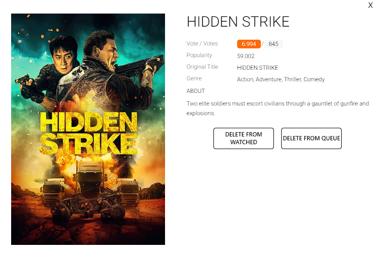

# Video Library - project

- Together with a team of dedicated individuals, I contributed to the development of a movie organization application. This project, crafted using JavaScript and Parcel bundler with the assistance of Notiflix, allows users to browse, search, and add movies to their "Watched" and "Queue" lists.
- live version [_here_](https://adrianblazejczyk.github.io/goit-Filmoteka)

## Table of Contents

- [General Info](#general-information)
- [Technologies Used](#technologies-used)
- [Project Responsibilities](#project-responsibilities)
- [Screenshots](#scrrenshots)
- [Setup](#setup)

## General Information

- This is a project created to expand knowledge and gain
  experience in teamwork and web app development.

## Technologies Used:

- JavaScript
- Parcel
- Noriflix
- HTML
- SASS

## Project Responsibilities
As a key contributor, my primary responsibilities included:

- Local Storage Handling:
  - Implemented functionality for saving and retrieving data from the local storage to ensure a seamless user experience with persistent "Watched" and "Queue" lists.
- Loader Integration:
  - Developed and integrated loader functionality to enhance user experience during data retrieval, ensuring a smooth transition between different states of the application.
- Placeholder Image Management:
  - Implemented a solution to display a placeholder image when a movie lacks a corresponding image in the database, ensuring a visually consistent and appealing interface.
- Modal Creation:
  - Designed and implemented a modal feature that enables users to effortlessly remove movies from both the "Watched" and "Queue" lists, enhancing the overall user interaction.
- Collaborative Efforts:
  - Collaborated with the team to optimize the display of movie cards, ensuring accurate data retrieval from the server, and contributed to the overall layout and functionality of the application.

## Screenshots
- 
- 
- 

## Setup

To run this project, install it locally using npm:

```
npm i
npm run start
```
